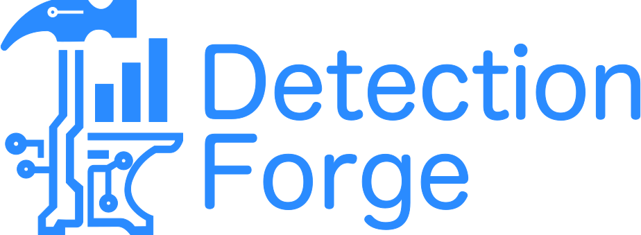

# DetectionForge



[](https://github.com/Digital-Defense-Institute/lc-detectionforge/actions/workflows/deploy.yml)
[](https://github.com/Digital-Defense-Institute/lc-detectionforge/stargazers)
[](https://github.com/Digital-Defense-Institute/lc-detectionforge/blob/main/LICENSE)

A comprehensive detection engineering environment built for crafting, validating, and testing detection rules on [LimaCharlie](https://limacharlie.io). Leveraging modern technologies such as Vue 3, TypeScript, and Vite, this platform delivers a seamless development experience for security engineers.

🔗 **[Try DetectionForge Live](https://detectionforge.ddi.sh)** | 📖 **[Documentation](#getting-started)** | 🤝 **[Contributing](#contributing)**

## Table of Contents

- [Overview](#overview)
- [Architecture](#architecture)
- [Features](#features)
- [Quick Start](#-quick-start)
- [Getting Started](#getting-started)
- [Detection Engineering Workflow](#detection-engineering-workflow)
- [Security Considerations](#security-considerations)
- [LimaCharlie Integration](#limacharlie-integration)
- [Documentation & Resources](#documentation--resources)
- [Contributing](#contributing)
- [License](#license)

## Overview

DetectionForge is a specialized tool designed for security engineers and analysts to develop, refine, and validate detection rules for the LimaCharlie platform. This comprehensive detection engineering environment streamlines the entire workflow from initial rule creation to historical validation using LimaCharlie's powerful replay capabilities.

**Key Detection Engineering Capabilities:**

- **Rule Development**: Create detection rules using guided wizards or manual IDE-like environments
- **Rule Validation**: Syntax checking and logical validation of detection rules
- **Historical Testing**: Leverage LimaCharlie's replay feature to test rules against historical data
- **Impact Analysis**: Determine how many historical detections would have fired with proposed rules
- **Iterative Refinement**: Quickly test, refine, and re-test detection logic

## Architecture

DetectionForge is built as a modern Vue.js Single Page Application (SPA) with:

- **Vue 3 + TypeScript**: Modern reactive framework with type safety
- **Vite**: Fast build tool and development server
- **Pinia**: State management for global application state
- **Vue Router**: Client-side routing for seamless navigation
- **CodeMirror 6**: Advanced code editor with YAML syntax highlighting, autocompletion, and smart editing
- **Composables**: Reusable business logic for storage, authentication, API calls, and configuration management
- **DOMPurify**: Secure HTML sanitization for safe content rendering
- **js-yaml**: Comprehensive YAML parsing and generation for IaC integration

## Features

DetectionForge is a **production-ready** detection engineering platform with comprehensive capabilities for crafting, testing, and deploying LimaCharlie detection rules. The application provides a complete workflow from rule development through testing and deployment.

### 🚀 Current Capabilities

#### Platform Foundation

- **Modern Architecture**: Vue.js SPA with TypeScript, Vite, and Pinia state management
- **LimaCharlie Integration**: Full API client with authentication and multi-organization support
- **Configuration Management**: Complete backup/restore system with bulk organization import
- **Cross-Platform Compatibility**: Works across all modern browsers including Safari

#### Rule Development & Management

- **Advanced YAML Editor**: CodeMirror integration with syntax highlighting and validation
- **Smart Autocompletion**: Context-aware suggestions for LimaCharlie operators, event types, and field paths
- **Rule Lifecycle Management**: Save, load, delete, and duplicate detection rules locally
- **Schema Validation**: Comprehensive validation against LimaCharlie rule schema
- **Infrastructure as Code**: Export/import rules in LimaCharlie IaC format with embedded unit tests

#### Testing & Validation Framework

- **Unit Testing**: Built-in framework with preset event samples and custom test data support
- **Historical Backtesting**: Multi-organization testing against historical telemetry via LimaCharlie's replay API
- **Detection Impact Analysis**: Analyze rule effectiveness and potential false positives
- **Auto-Draft System**: Automatic saving of work-in-progress with recovery capabilities
- **Event Schema Explorer**: Browse and explore LimaCharlie event schemas with field type information

#### Collaboration & Workflow

- **Team Configuration Sharing**: Export/import complete workbench configurations
- **Notification System**: User-friendly notifications for all operations
- **Real-time Validation**: Immediate feedback on rule syntax and logic

### 🔮 Future Enhancements

#### 🧙‍♂️ Rule Building Wizard

- Guided interface for creating detection rules
- Template-based rule generation
- Best practices integration
- Common detection pattern library

#### 🔄 Rule Deployment & Synchronization

- Import and sync detection rules from connected LimaCharlie organizations
- Publish rules directly to connected organizations from the workbench
- Bidirectional rule synchronization with version conflict resolution
- Deployment status tracking and rollback capabilities

#### 📊 Detection Analytics

- Historical detection frequency analysis
- Rule effectiveness metrics and performance analytics
- False positive/negative rate calculation and analysis
- Detection coverage assessment tools

#### 🤖 AI & LLM Integration

- **Intelligent Rule Generation**: Generate detection rules from natural language descriptions of attack patterns
- **Rule Optimization Suggestions**: AI-powered recommendations for improving rule performance and reducing false positives
- **Threat Intelligence Enrichment**: Automatic integration of threat intelligence to enhance rule context and accuracy
- **Natural Language Rule Documentation**: Generate human-readable explanations of complex detection logic
- **False Positive Analysis**: AI-driven analysis of backtesting results to identify and suggest fixes for false positives
- **Rule Translation**: Convert rules between different detection platforms and formats
- **Attack Pattern Recognition**: Identify common attack patterns in telemetry data and suggest relevant detection rules
- **Rule Quality Scoring**: AI assessment of rule effectiveness, performance, and maintenance requirements

## 🚀 Quick Start

### Option 1: Use the Live Application (Recommended)

1. Visit [https://detectionforge.ddi.sh](https://detectionforge.ddi.sh)
2. Configure your LimaCharlie credentials and organizations
3. Start crafting and testing your detection rules

### Option 2: Run Locally\*\*

See the [Installation & Setup](#installation--setup) section below for detailed local development instructions.

## Getting Started

### Prerequisites

**For Using DetectionForge (Live or Local):**

- **LimaCharlie Account**: An active LimaCharlie account with detection rule management permissions
- **Organization Access**: Access to a LimaCharlie organization with historical data
- **API Credentials**:
  - Organization ID (OID)
  - User ID (UID)
  - API Key with appropriate permissions for:
    - Reading historical data
    - Managing detection rules
    - Accessing replay functionality

**Additional Requirements for Local Development:**

- **Node.js**: Version 18 or higher

### Installation & Setup

> Only necessary if you plan to run it locally (not required)

1. **Clone the repository**:

   ```bash
   git clone https://github.com/Digital-Defense-Institute/lc-detectionforge.git
   cd lc-detectionforge
   ```

2. **Install dependencies**:

   ```bash
   npm install
   ```

3. **Start the development server**:

   ```bash
   npm run dev
   ```

4. **Open your browser** and navigate to `http://localhost:5173`

5. **Configure your environment**:

   - Navigate to the Configuration page
   - Set up your LimaCharlie credentials and organizations (individual or bulk import)
   - Test your API connection
   - Optionally export your configuration for backup

6. **Begin detection engineering**: Start crafting and testing your detection rules

## Detection Engineering Workflow

### 1. Configuration Setup

Initial workbench configuration:

- **Credential Management**: Set up LimaCharlie API credentials (UID, API Key)
- **Organization Setup**: Add organizations individually or via bulk import using OID lists
- **Configuration Backup**: Export your complete configuration for backup and sharing
- **Configuration Restore**: Import previously saved configurations to restore settings

### 2. Event Schema Exploration

- Browse and explore available LimaCharlie event schemas from your organizations
- View field types, data structures, and available event types
- Copy schema elements to clipboard for easy reference
- Filter schemas by category (sensor events, detections, artifacts, etc.)
- Real-time schema loading from connected organizations

### 3. Rule Development

Create detection rules using:

- **Manual Editor**: Direct rule writing with YAML syntax highlighting
- **Rule Templates**: Common detection patterns and examples
- **Real-time Validation**: Immediate feedback on rule syntax and logic

### 4. Rule Validation

- Syntax checking against LimaCharlie rule schema
- Logical validation of rule conditions and operators
- Required field validation for detect and respond logic
- Performance impact assessment hints

### 5. Rule Management

- Save rules locally for iterative development
- Load and edit existing rules
- Duplicate rules for creating variations
- Export rules to Infrastructure as Code format

### 6. Unit Testing

- Test rules using the built-in unit testing framework
- Use preset event samples or create custom test data
- Validate detection logic with expected match/no-match results
- Get detailed test results and match analysis
- Persist unit tests with saved rules for comprehensive validation

### 7. Historical Backtesting

- Test rules against historical telemetry using LimaCharlie's replay feature
- Select multiple organizations for comprehensive testing
- Configure time ranges and processing limits
- Analyze detection frequency, patterns, and potential false positives
- Export backtest results for further analysis

### 8. Infrastructure as Code Integration

- Export detection rules in LimaCharlie IaC format with embedded unit tests
- Import existing rules from IaC YAML files
- Support for multiple rules in single IaC files
- Automatic extraction of unit tests from IaC imports
- Version control ready exports for CI/CD integration

### 9. Deploy & Monitor

- Export rules in IaC format for deployment through version control and automated pipelines
- Monitor rule performance in production environments

## Security Considerations

This workbench uses a secure, memory-only credential storage approach:

- **In-Memory Only**: API credentials and JWT tokens are stored only in browser memory and automatically clear when the app is closed
- **No Persistent Storage**: Sensitive credentials and JWTs never touch localStorage or other persistent storage
- **Session-Based Security**: Each browser session requires fresh credential entry and JWT generation
- **Auto-Cleanup**: Refreshing or closing the browser/tab immediately clears all credential and JWT data

For production detection engineering:

- Use dedicated detection engineering environments
- Follow your organization's credential management policies
- Regularly rotate API keys used for detection development
- Audit and review all detection rules before deployment

## LimaCharlie Integration

This workbench integrates with LimaCharlie's platform through several key APIs:

- **Replay API**: For rule testing and validation against sample events and historical telemetry data
- **Schema API**: For exploring event schemas and field structures from connected organizations
- **Organizations API**: For multi-organization management and retrieving organization-specific URLs
- **Authentication API**: For secure JWT-based authentication and credential management

_Note: Direct rule deployment capabilities are planned for future releases. Currently, rules are exported in Infrastructure as Code format for deployment through existing LimaCharlie workflows._

## Documentation & Resources

- [LimaCharlie Detection & Response Documentation](https://docs.limacharlie.io/docs/detection-and-response)
- [LimaCharlie Replay API Documentation](https://docs.limacharlie.io/docs/replay)
- [LimaCharlie API Reference](https://docs.limacharlie.io/docs/api-keys)
- [LimaCharlie Community](https://community.limacharlie.com/)

## Contributing

**We welcome and encourage contributions from the security community!** 🎉

DetectionForge is an open-source project designed to evolve with the needs of detection engineers and security analysts. Whether you're fixing bugs, adding features, improving documentation, or sharing detection patterns, your contributions help make this tool better for everyone.

### How to Contribute

- **🐛 Bug Reports**: Found an issue? Please open a GitHub issue with detailed reproduction steps
- **💡 Feature Requests**: Have an idea for improvement? We'd love to hear about it in our issues
- **📝 Documentation**: Help improve our docs, add examples, or clarify existing content
- **🔧 Code Contributions**: Submit pull requests for bug fixes, new features, or performance improvements

### Contributor Workflow (Simplified!)

**For Contributors - Focus on Your Code:**

1. **Fork the repository** and create a feature branch from `main`
2. **Implement your feature or fix** - focus only on your changes
3. **Follow our code style** - we use TypeScript, ESLint, and Prettier
4. **Test your changes** thoroughly before submitting
5. **Submit a pull request** with clear description

**What You DON'T Need to Worry About:**

- ❌ Version number updates
- ❌ Changelog maintenance  
- ❌ Release coordination
- ❌ Compatibility with other pending PRs

**Maintainers Handle:**

- 🏷️ Version management and releases
- 📝 Changelog aggregation from multiple PRs
- 🔄 Release branch coordination and CI/CD validation
- 🚀 Deployment and tagging

This approach allows contributors to focus on their implementations while maintainers coordinate releases that may include multiple features and fixes together.

### Detailed Guidelines

For comprehensive contribution guidelines, development setup, and release processes, see [CONTRIBUTING.md](CONTRIBUTING.md).

### Development Setup

```bash
# Clone your fork and navigate to directory
git clone https://github.com/Digital-Defense-Institute/lc-detectionforge.git
cd lc-detectionforge

# Install dependencies
npm install

# Start development server with hot reload
npm run dev

# Run linting
npm run lint

# Run type checking
npm run type-check

# Build for production
npm run build
```

#### Recommended IDE Setup

- [Visual Studio Code](https://code.visualstudio.com/) - Primary recommended editor
- [Volar](https://marketplace.visualstudio.com/items?itemName=Vue.volar) - Vue Language Features (disable Vetur if installed)
- [TypeScript Vue Plugin](https://marketplace.visualstudio.com/items?itemName=Vue.vscode-typescript-vue-plugin) - TypeScript support in Vue SFCs
- [ESLint](https://marketplace.visualstudio.com/items?itemName=dbaeumer.vscode-eslint) - Code linting and formatting
- [Prettier](https://marketplace.visualstudio.com/items?itemName=esbenp.prettier-vscode) - Code formatting
- [EditorConfig](https://marketplace.visualstudio.com/items?itemName=EditorConfig.EditorConfig) - Consistent coding styles

**Note**: The workspace includes a `.vscode/extensions.json` file that will automatically suggest these extensions when you open the project in VS Code.

### Current Capabilities & Future Focus

DetectionForge currently includes comprehensive configuration management with backup/restore functionality and bulk organization import. Future enhancements will focus on:

- **Advanced Detection Libraries**: Curated detection pattern repositories
- **Threat Intelligence Integration**: Connect with external threat feeds
- **Team Collaboration Features**: Real-time collaborative detection engineering
- **Rule Deployment Automation**: Direct synchronization with LimaCharlie organizations
- **Advanced Analytics**: Rule effectiveness metrics and optimization recommendations
- **Enhanced Export/Import**: Support for additional detection platforms

### Community & Support

- **GitHub Issues**: For bug reports and feature requests
- **Discussions**: Share ideas, ask questions, and connect with other users
- **Security Issues**: Please report security vulnerabilities privately

**Every contribution matters!** From fixing typos to implementing major features, we appreciate all efforts to improve DetectionForge for the security community.

## License

DetectionForge is released under the **GNU Affero General Public License v3.0 or later (AGPL-3.0-or-later)**.

This means you can:

- ✅ **Use** the software for any purpose (personal, commercial, research, etc.)
- ✅ **Study** and modify the source code
- ✅ **Distribute** copies of the software
- ✅ **Distribute** your modifications

**However**, if you modify DetectionForge and serve it where others can access it (including through a web interface), you **must** make your modified source code available under the same license. This ensures that improvements to DetectionForge always benefit the security community.

For the complete license terms, see [LICENSE](LICENSE) or visit <https://www.gnu.org/licenses/agpl-3.0.html>.
